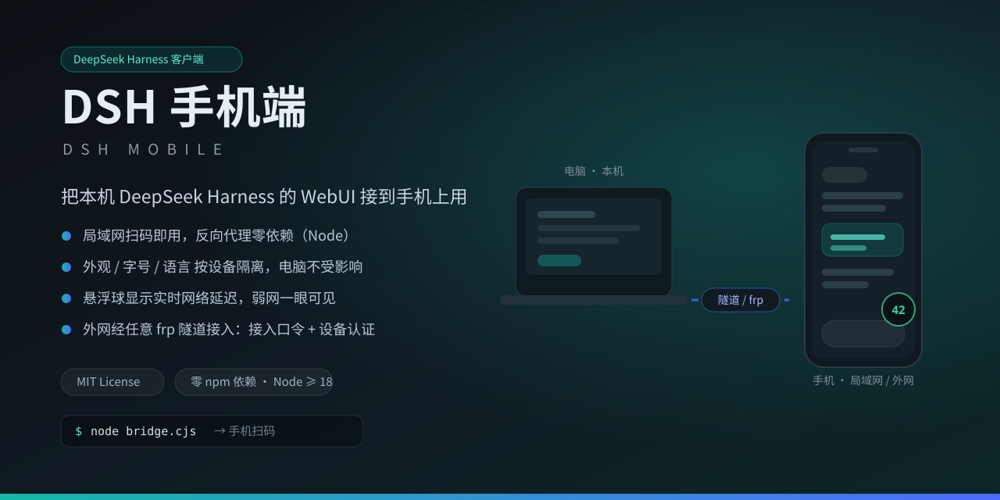
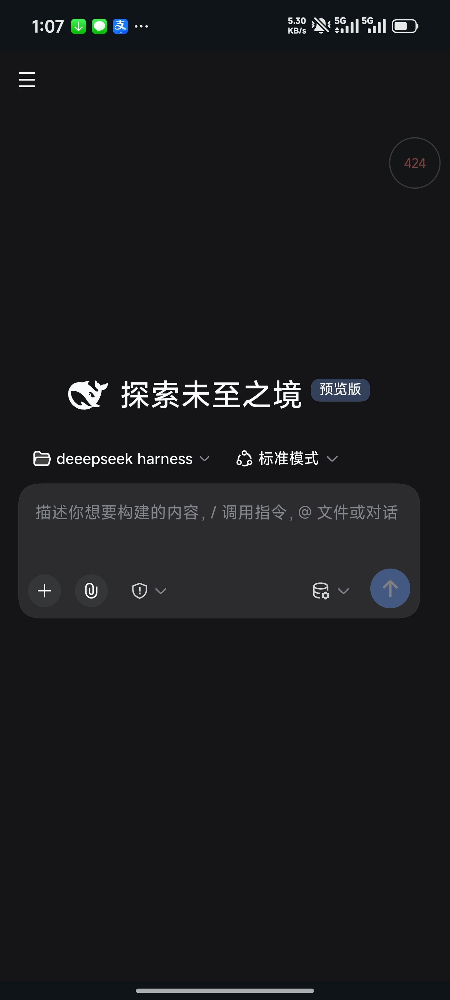
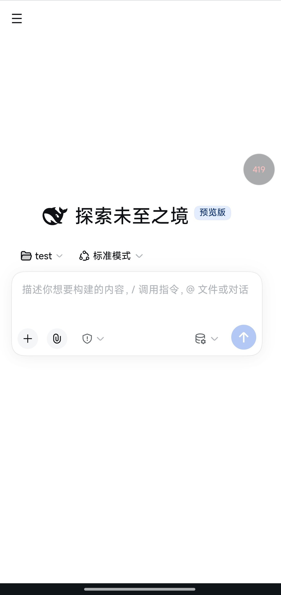
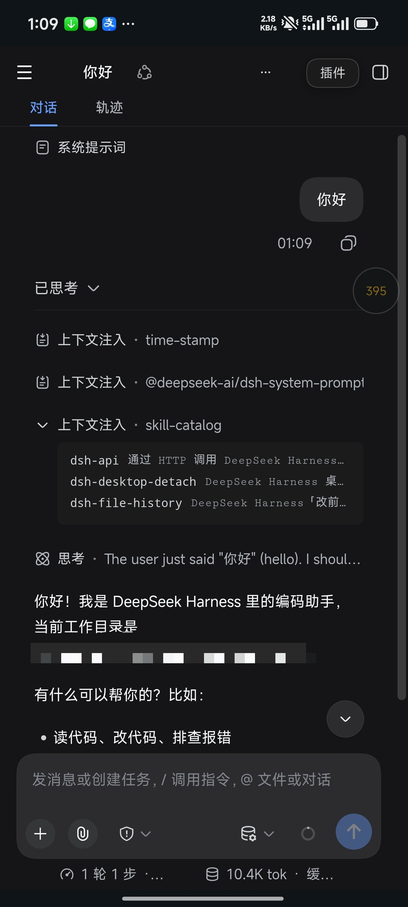
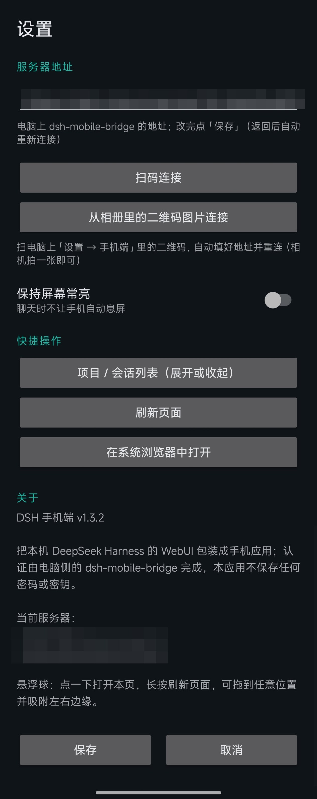
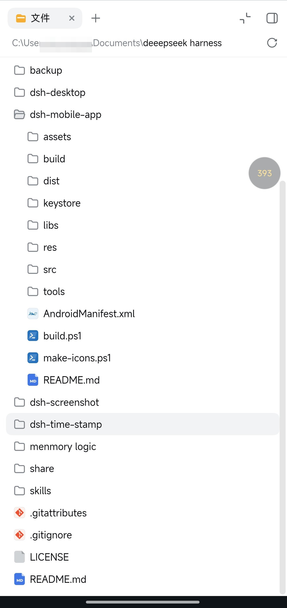
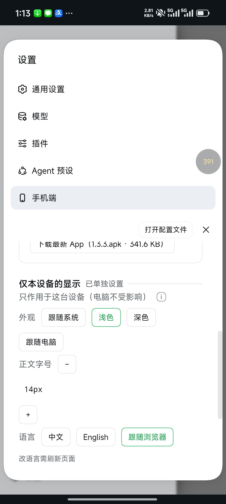
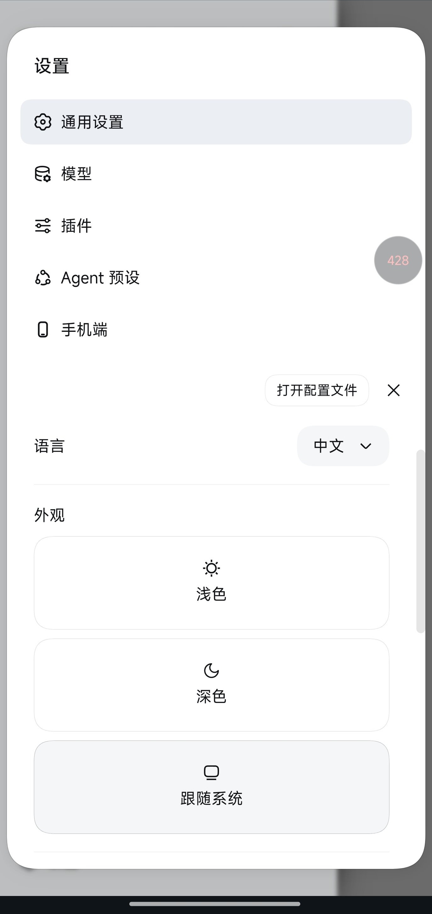
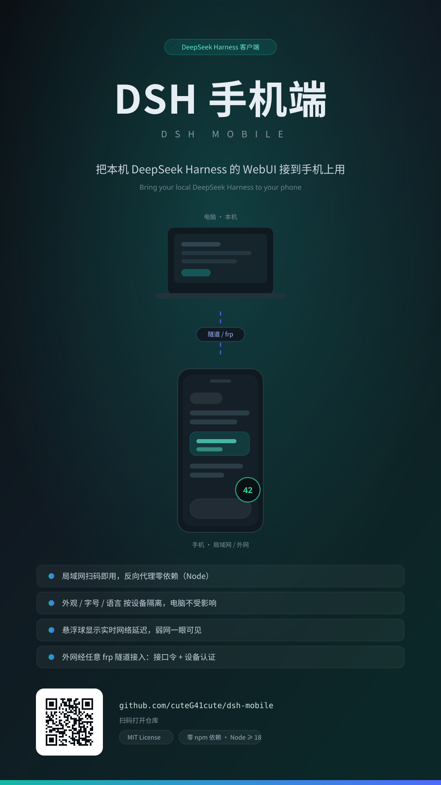

# DSH 手机端（DeepSeek Harness Mobile）



把本机的 **DeepSeek Harness** WebUI 接到手机上用：局域网扫码即用，需要时再通过任意 frp 隧道从外网接入。

> Bring your local DeepSeek Harness WebUI to your phone — over LAN by QR code, over WAN through any frp tunnel.

## 截图

| 深色（跟随系统） | 浅色 | 会话界面 |
| --- | --- | --- |
|  |  |  |

界面右侧的圆球是**实时网络往返延迟**（绿 <150ms / 黄 <400ms / 红更慢）；点一下进 App 设置，长按刷新页面，可拖到任意位置并吸附边缘。
深色 / 浅色既支持「跟随系统」（系统切深浅时实时跟着变），也支持按设备单独指定。

### App 设置与文件浏览

| 首次打开就是这一页（App 设置） | 文件浏览（DSH 自身的「文件」页） |
| --- | --- |
|  |  |

还没填地址时 App 直接停在设置页：**扫码连接**、**从相册里的二维码图片连接**、保持屏幕常亮、快捷操作（展开/收起会话列表、刷新页面、在系统浏览器中打开），底部是版本号与当前服务器地址。填好一次即长期使用，之后打开直达界面。
右侧是 DSH 自带的文件浏览在手机上的样子——翻目录、看文件、改分辨率都不用换设备。

## 它做了什么

| 能力 | 说明 |
| --- | --- |
| 手机接入桥 | 一个零依赖的 Node 反向代理（默认 `0.0.0.0:8099` → `127.0.0.1:3080`），替手机侧签发 harness 认证 cookie，并把请求 Host/Origin 归一化成受信任来源 |
| 移动端适配 | 往页面注入移动端适配（☰ 抽屉、宽度门控、悬浮球），不改产品源码 |
| 「手机端」设置面板 | 二维码（局域网/外网）、App 下载、设备管理（允许/拒绝/踢出/完全信任）、接入口令 |
| 设备身份与认证 | 粗粒度机型特征码（+ 安卓 App 的 Android ID）→ 随机 ID；新设备在本机点 ✓ 才放行；口令每 7 天自动轮换，「完全信任」设备免口令 |
| 按设备隔离的设置 | 外观 / 字号 / 语言按设备生效，不影响电脑 |
| 传输优化 | 压缩透传 + 桥侧 brotli，首屏字节约为原来的 1/3 |
| 外网接入 | 任何 frp / 内网穿透都行；自带 Let's Encrypt 证书自动续期脚本（HTTP-01，无需服务商 API 密钥） |
| 抗更新退化 | 注入前清单自检 + `/__selftest` + 桌面启动器自检不过就回退官方端口 |

## 目录

```
bridge/   手机接入桥（Node，零依赖）+ 手机端面板 + 移动端适配注入 + 证书脚本
app/      安卓 App（原生 WebView 壳，无 Gradle/AndroidX，用 build-tools 直接构建）
docs/     部署清单（换一台机器怎么装）
```

## 快速开始

前提：本机已能跑 `dsh web`（默认 `127.0.0.1:3080`），Node ≥ 18。

```bash
# 1) 电脑：启动桥
node bridge/bridge.cjs              # 默认 0.0.0.0:8099 → 127.0.0.1:3080
node bridge/bridge.cjs --port 8099 --target http://127.0.0.1:3080

# 2) 电脑：放行防火墙（Windows 管理员运行一次）
powershell -ExecutionPolicy Bypass -File bridge/allow-firewall.ps1

# 3) 打开 http://127.0.0.1:8099/ ——「设置 → 手机端」里有二维码
```

手机与电脑同一 Wi-Fi → 浏览器扫码即用；页面里可直接下载安卓 App（也可以在 App 内「扫一扫」直接连上）。

外网接入见 `docs/SETUP.md`（隧道 → 域名 → 证书 → 二维码）。

## 安卓 App

`app/dist/dsh-mobile-1.3.3.apk` 是可直接安装的构建产物（自签名，仅供自用）。自己改代码后重新构建：

```powershell
cd app
powershell -ExecutionPolicy Bypass -File build.ps1 -VersionCode 10 -VersionName 1.4.0
```

需要本机有 Android SDK 的 build-tools（aapt2 / d8 / zipalign / apksigner）。**签名密钥请自行生成**（`keystore/` 不入库）。

## 安全模型（请务必读）

- 桥端口**等价于本机 shell 权限**：能打开它的人即可读写文件、执行命令。**只暴露桥端口，绝不要暴露 3080**；
- 三道闸门：接入口令（外网必须带）+ 设备认证（本机点 ✓）+ 可选「完全信任」（免口令，可随时撤销）；
- 桥不给页面注入任何远程代码：面板/适配脚本都是本地文件；
- 建议：只用在家用网络 + 自己的隧道；不要把端口映射到公网裸奔。

## 已知边界

- 依赖 DSH 的页面结构与启动清单；DSH 大版本更新后若结构变化，最坏情况是**少个面板、页面照常**（不会白屏）；
- `/api/settings/describe` 在新版 DSH 上已不存在，因此「按设备隔离」改走页面注入（见 `bridge/README.md`）；
- 语言切换在页面加载时解析，改完需刷新一次。

## 提个醒：两处设置别混淆

- **设置 → 通用设置** 里的 语言 / 外观 / 字号是**全局**的：在任何设备上改，所有设备（含电脑）一起变；
- **设置 → 手机端 →「仅本设备的显示」** 只作用于当前这台设备：电脑不受影响，按设备保存（换浏览器、重装后仍沿用）。语言在页面加载时解析，改完刷新一次。

| 设置 → 通用设置（全局） | 设置 → 手机端（只影响这一台） |
| --- | --- |
|  |  |

## 宣传图

分享用（矢量源文件在 `docs/`，PNG 版同目录）：

| 横版 1280×640 | 竖版 1080×1920 |
| --- | --- |
|  |  |

`banner.png` 可直接用作 GitHub 社交预览图；`poster.png` 底部的二维码指向本仓库（已用 ZXing 实测可扫）。

## 许可

本项目自己的代码：**MIT**（见 `LICENSE`）。
仓库里另有两个第三方文件（ZXing 的 Apache-2.0 jar、qrcode-generator 的 MIT 源码），逐项声明与许可全文见 **`THIRD-PARTY.md`**。
